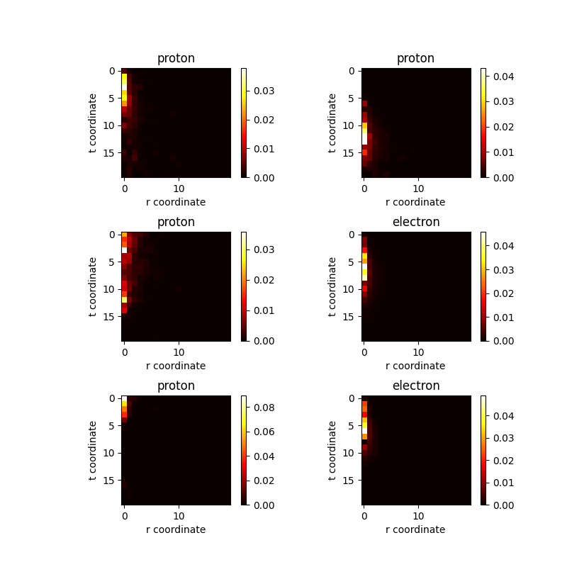

# Dataset description
The _.root_ files are stored inside the _enebins_ directory. File names beginning with _e_ refer to electrons, while file names beginning with _p_ refer to protons.

# Energies
Files are divided by the total energy released by the calorimeter (N.B. this energy isn't necessarily the initial energy of the particle).

The files are divided in logaritmic bins, therefore the ratio between the energy of the i-th bin and the (i+1)-th bin is fixed.
The only execption is the first _0-100_ bin where all the events with less than 100 GeV can be found.

# File contents
Each file contains a _tree_ called `showers` that is divided in 3 _branch_:
- id: progressive number identifing the event globally (for all the energy level of that particular particle),
- E0: initial energy of the particle,
- dep: array with a fraction of mean energy deposit in a particular bin of `t` and `r` , the longitudinal and transversal coordinates of the swarm.
Each tree can be thought of as a table and each branch as a column, while each row corrisponds to an event.

# Deposit characteristics
Each array has 400 elements, representing an unraveled 20x20 matrix.

The deposit values in each cell are normalized to the total deposit of the event and should therefore be always between 0 and 1.

# Accessing data
The python library `uproot` can be used to import each `tree` as a `numpy.array` or a `pandas.Dataframe`, as shown in the following snippet: 
```
import uproot as up
import numpy as np

e_file = up.open("path/enebins/e_100-126_eventTables.root")
print(e_file.keys()) 
# ['showers;1']
print(e_file['showers']) 
# <TTree 'showers1' (3 branches) at 0x...>
file = data['showers'].arrays(library='np') 
print(file)
###
{'id': array([   7,   10,   21, ..., 5560, 5563, 5571]), 'dep': array([array([3.30298914e-04, 0.00000000e+00, 0.00000000e+00, 0.00000000e+00, ..., 0.00000000e+00])], dtype=object), 'E0': array([0.00000000e+00, 3.86190308e+02, 0.00000000e+00, ..., 1.63907128e+06, 1.63907128e+06, 1.63907128e+06])}
###

dep = e_file["showers"]["dep"].array(library="np")
dep0 = dep[0].reshape(20,20) 
...
```
After converting the data to a numpy array, it is easily accessible and usable. The data used is interpreted as 20x20 image, presented using _matplotlib_:



# Directory Structure

## utils.py

Containes some preliminary functions:

- __convert_root_to_csv__(data_root, energy_flag=False) opens the root files inside the directory _data\_root_/_enebins_ and writes the data in a csv file inside _data\_root_/_data_. The _energy\_flag_ is used to choose if the energy deposit has to be included in the csv file. Some checks are performed to ensure that the data is consistent, like only accepting positive energy and 20x20 grids

- __findMaxMin__(data_root, energy_flag=False, size=10626) finds the maximum and minimum _non-zero_ values inside the dataset and saves it inside _data\_root_/_data_, this information will be used to "scale" the dataset to avoid numerical problems

- __splitTrainTest__(data_root, scaled=False, energy_flag=False, size=10626, mod=8) splits the csv file contained in the directory _data\_root_/_data_ in three different csv files to be used for training, validation and testing. _energy\_flag_ and _scaled_ are used to choose one the different datasets "styles", _size_ and _mod_ are used in the splitting process

- __scaleDataset__(data_root, scalefactor=1000000, energy_flag=False, size=10626) multiplies each deposit by a contant _scalefactor_

- __plotExample__(data_root, amount, scaled=False, energy_flag=False, size=10627) plots an _amount_ of items from the dataset to test if the conversion process was successful

The file also contains a _main()_ function to test all the methods defined.

## dataset.py 

Opens the data and serves it to the DataLoader

- __\_\_init\_\___(self, data_root=os.getcwd(), scaled=False, type='train', seed=42) is the constructor, _type_ is used to discriminate between the DataLoader of the train, validation or test data. The _scaled_ flag is used to choose which version of the dataset to load. At this stage the data is a string taken from the csv file

- __\_\_getitem\_\___(self, index) takes the _index_ line inside the dataset and converts it into two torch Tensors, the first contains the label, the second the data

The file also contains a _main()_ function to test all the methods defined.

## net.py

Defines the neural network topology

- __\_\_init\_\___(self, type) is the constructor, _type_ is used to choose between two different structures, either `convolutional` or `fully connected`

- __forward__(self, x) defines how the data _x_ moves through the neural network

## solver.py

Handles the training process

- __\_\_init\_\___(self, args) sets all the parameters for the optimization, like the loss function, the optimizer and the scheduler

- __fit__(self) defines the training stage of the network

- __evaluate__(self, data) is used to monitor performances during training by checking the accuracy of the predictions in the training and validation set

- __save__(self, ckpt_name, global_step) saves the state of the network parameters during training

- __export__(self) saves the final model inside the _model_ directory after the training is finished

- __test__(self) after the training is done to check performances on data that the network has not seen before

## start.py

Initializes all the parameters needed and starts the training process. To train the network one can simply use `python start.py` after settings the right parameters in the script

## loadAndTest.py

Loads the exported model and uses it to make a prediction on the test data

# Requirements